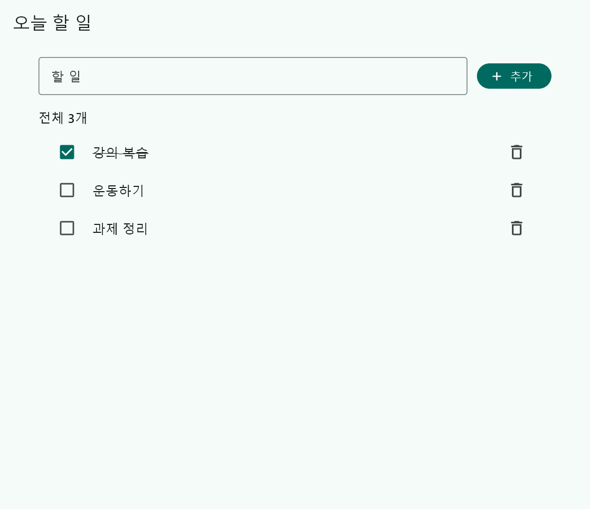
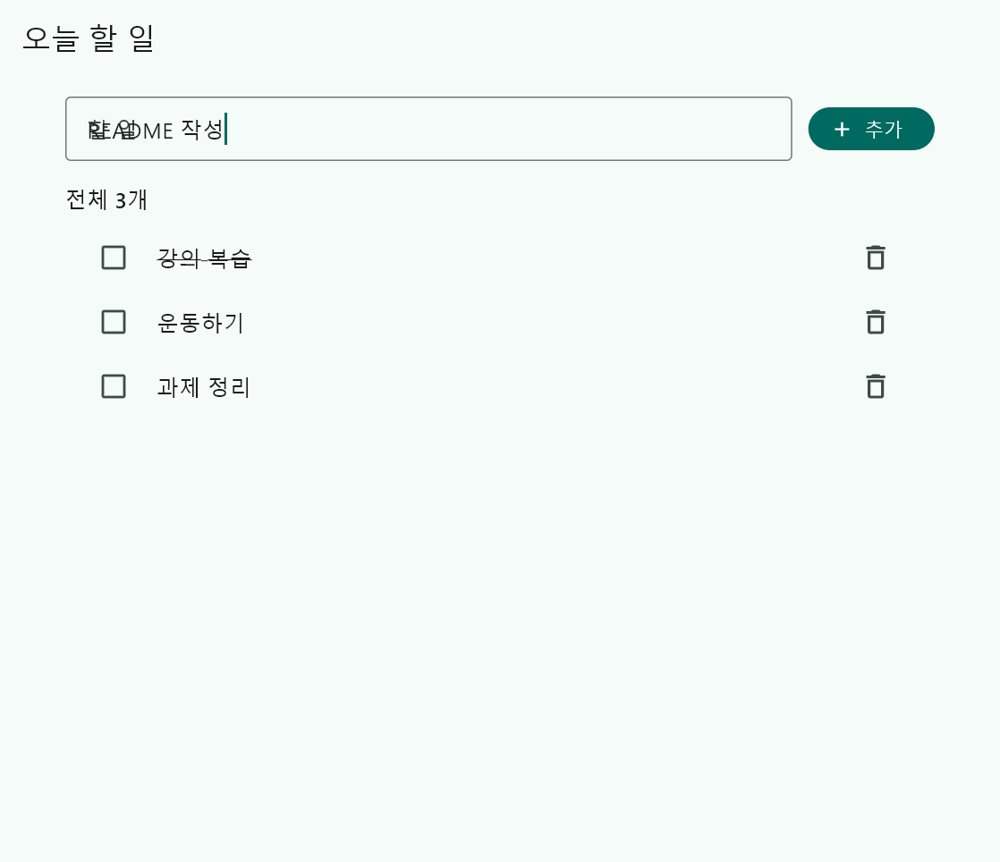
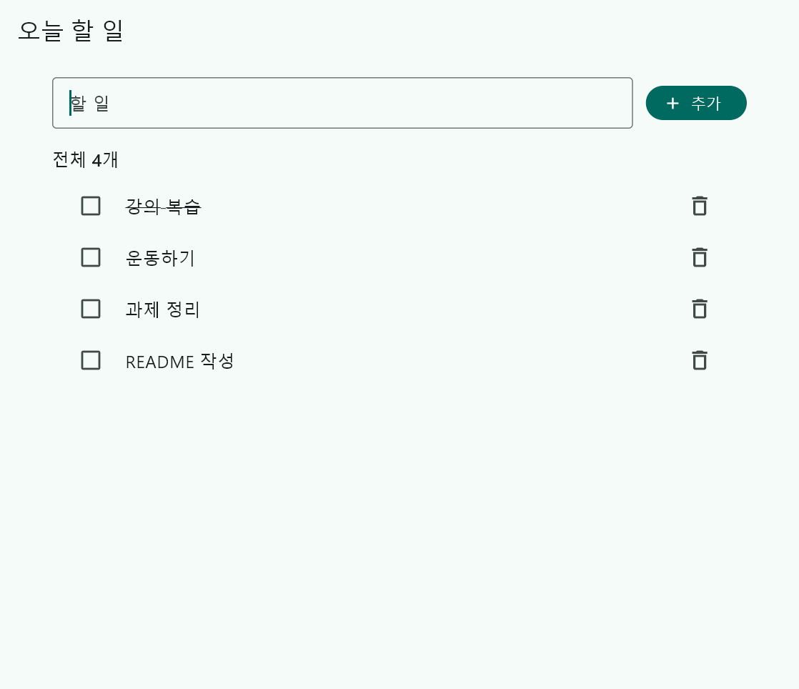
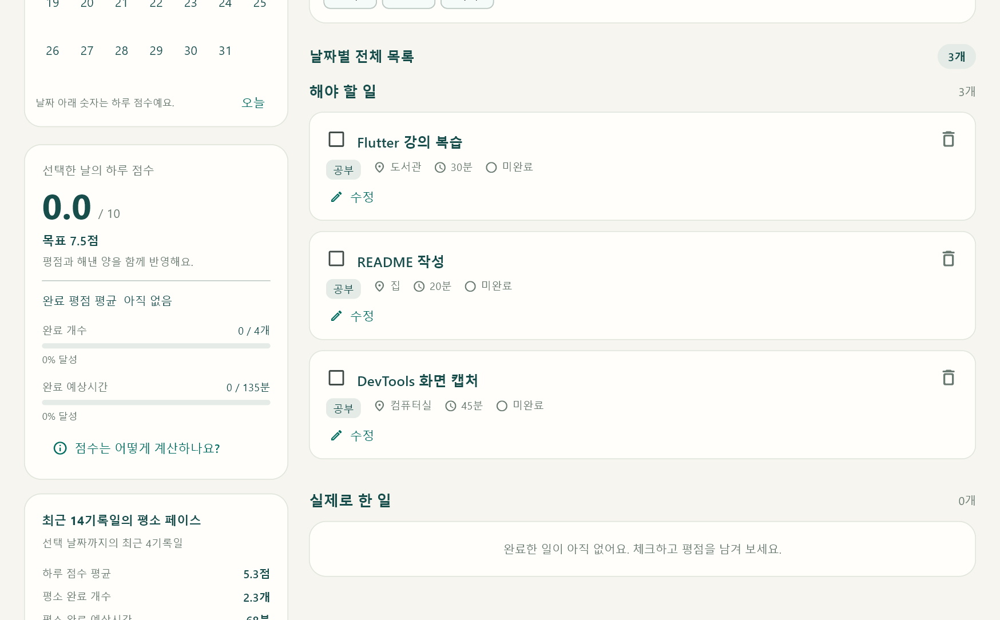
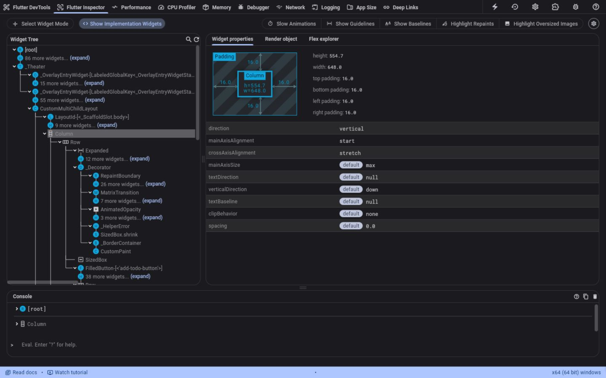
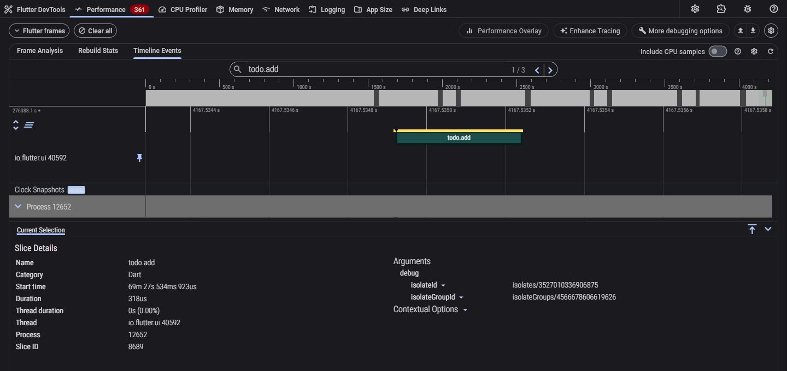
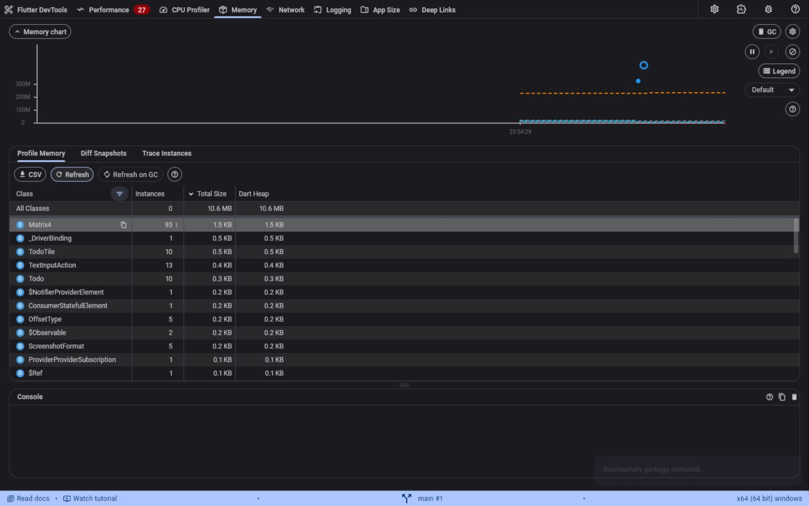
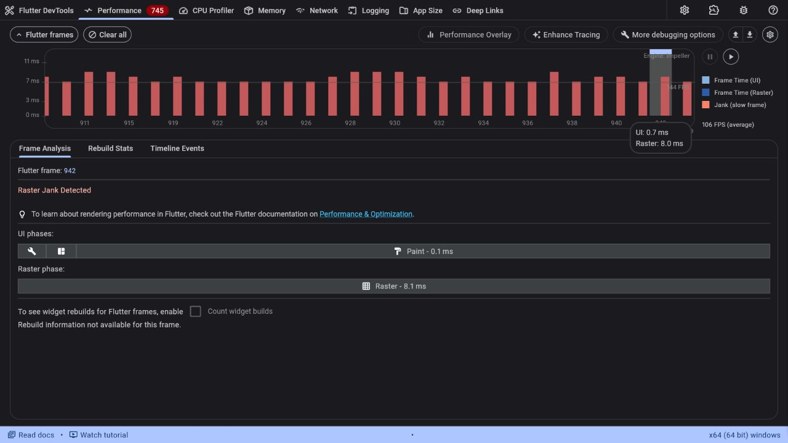

# 오늘 할 일 - Flutter To Do 앱

목록·추가·삭제와 완료 체크를 제공하는 Windows 네이티브 앱입니다. 할 일 목록은 Riverpod으로 관리합니다.

## 1. 빌드 및 실행 방법

### 준비 사항

Flutter SDK의 bin 폴더가 PATH에 등록된 Windows 컴퓨터가 필요합니다. Visual Studio 또는 Build Tools에 **Desktop development with C++**와 Windows SDK를 설치합니다. ZIP을 풀고 **pubspec.yaml이 있는 폴더에서 PowerShell**을 엽니다.

### 1-1. 개발 환경 확인

```powershell
flutter --version
flutter doctor -v
```

flutter doctor에서 Windows 빌드 도구가 준비되었는지 확인합니다. 검증 환경은 Flutter 3.47.6, Dart 3.13.5, flutter_riverpod 3.4.3, DevTools 2.60.0, Windows x64입니다.

### 1-2. 의존성 설치 후 앱 실행

```powershell
flutter pub get
flutter run -d windows
```

첫 번째 명령은 필요한 패키지를 설치하고, 두 번째 명령은 앱을 빌드하여 Windows 창으로 실행합니다. 제목 입력 후 추가 버튼 또는 Enter, 완료 체크박스, 휴지통 버튼을 사용합니다. 터미널에서 q를 누르면 종료됩니다.

### 1-3. 실행 파일 빌드 및 실행

```powershell
flutter build windows --release
.\build\windows\x64\runner\Release\today_todo.exe
```

첫 번째 명령은 release 실행 파일을 만들고, 두 번째 명령은 만들어진 앱을 실행합니다. Release 폴더의 DLL과 data도 함께 필요합니다. 제출 ZIP에는 의존성과 빌드 결과가 포함되지 않으므로 먼저 위 명령으로 빌드합니다.

**데이터 보관:** 메모리에만 저장하므로 앱 종료·재시작 시 목록은 빈 상태로 돌아갑니다.

<!-- page: portrait -->
## 2. 어떻게 구현했는가 - 화면과 코드 구조

### 파일별 역할

| 파일 | 담당하는 부분 |
| --- | --- |
| lib/main.dart | ProviderScope로 상태 제공, MaterialApp과 시작 화면 설정 |
| lib/models/todo.dart | 한 할 일의 데이터: ID, 제목, 완료 여부 |
| lib/providers/todo_provider.dart | 전체 목록과 추가·삭제·완료 변경 로직 |
| lib/screens/todo_screen.dart | 입력창, 추가 버튼, 전체 개수, 목록 배치 |
| lib/widgets/todo_tile.dart | 한 줄의 제목, 체크박스, 삭제 버튼 |

### 위젯 배치

```text
ProviderScope
  TodayTodoApp (StatelessWidget)
    MaterialApp
      TodoScreen (ConsumerStatefulWidget)
        Scaffold
          AppBar
          SafeArea > Center > ConstrainedBox > Padding
            Column
              Row: TextField + FilledButton.icon
              Text: 전체 개수
              Expanded > ListView.builder
                TodoTile (StatelessWidget)
                  ListTile: Checkbox + Text + IconButton
```

### 화면에서 보이는 요소와 실제 위젯

| 화면 요소 | 위젯과 역할 |
| --- | --- |
| 오늘 할 일 제목 | AppBar: 화면의 상단 제목 |
| 제목 입력창 | TextField: TextEditingController로 입력 읽기 |
| 추가 버튼 | FilledButton.icon: _addTodo() 호출, Enter도 같은 처리 |
| 전체 N개 | Text: todos.length 표시 |
| 할 일 목록 | ListView.builder: 항목 수에 따라 TodoTile 생성 |
| 한 할 일 | TodoTile의 ListTile: 체크박스·제목·삭제 버튼 배치 |
| 완료·삭제 | Checkbox는 완료 반전, IconButton은 해당 ID 삭제 |

입력창·목록은 Column으로 세로 배치하고 입력창·추가 버튼은 Row로 가로 배치했습니다. Expanded가 남은 공간을 목록에 배정합니다. 입력 controller와 FocusNode는 TodoScreen이 소유하고 dispose에서 정리합니다. 완료한 제목에는 취소선을 표시하며 빈 목록에는 안내 문구를 표시합니다.

<!-- page: portrait -->
## 3. 상태 자료구조와 변경 흐름

### 한 항목은 Todo, 전체 목록은 List<Todo>

| Todo 필드 | 자료형 | 의미 |
| --- | --- | --- |
| id | int | 항목을 구분하는 고유 번호 |
| title | String | 입력한 할 일 제목 |
| isCompleted | bool | 완료 여부, 처음에는 false |

예를 들어 두 항목의 상태는 아래처럼 표현됩니다. 각 Todo의 필드는 final이며 완료 변경은 copyWith로 새 Todo를 만듭니다.

```dart
List<Todo> todos = [
  Todo(id: 1, title: '강의 복습', isCompleted: true),
  Todo(id: 2, title: '운동하기'),
];
```

### 어떤 동작이 어떤 데이터를 바꾸는가

| 동작 | 처리 | 화면 결과 |
| --- | --- | --- |
| 추가 | addTodo: trim 후 새 ID의 Todo를 목록 끝에 추가 | 입력창 초기화, 전체 개수 증가 |
| 삭제 | deleteTodo(id): 해당 ID만 제외한 새 목록 생성 | 선택한 줄 제거, 전체 개수 감소 |
| 완료 체크 | toggleTodo(id): isCompleted 반전 | 체크 상태·제목 취소선 변경 |

공백뿐인 제목은 추가하지 않고 오류를 표시합니다. 같은 제목도 ID가 다르면 다른 항목입니다. ID는 정상 추가마다 증가하고 삭제 후 재사용하지 않습니다. 없는 ID의 삭제·완료 요청은 다른 항목에 영향을 주지 않습니다.

### Riverpod으로 화면에 반영되는 흐름

<!-- diagram: state -->

화면 이벤트는 ref.read(todoProvider.notifier)로 메서드를 호출합니다. Notifier는 기존 목록을 수정하는 대신 **List<Todo>.unmodifiable로 만든 새 목록을 state에 대입**합니다. TodoScreen의 ref.watch(todoProvider)가 변경을 구독하여 목록을 다시 표시합니다.

할 일 목록·완료 여부는 Riverpod 상태이고, 입력 중인 문자열·오류 문구·포커스는 화면의 임시 상태입니다. 저장 대기 단계가 없어 동기 Notifier를 사용합니다.

<!-- page: portrait -->
## 4. Bonus Points 구현 내용

### Bonus 1. Riverpod 사용 - 10점 항목

**기본 To Do 앱의 목록과 완료 상태를 Riverpod으로 관리했습니다.** 별도의 보너스용 앱이나 화면을 만들지 않고 리스트·추가·삭제 동작에 적용했습니다.

```dart
final todoProvider = NotifierProvider<TodoNotifier, List<Todo>>(
  TodoNotifier.new,
);
```

| 사용 위치 | 적용 내용 |
| --- | --- |
| main.dart | ProviderScope가 앱에 provider 사용 환경 제공 |
| todo_provider.dart | TodoNotifier가 List<Todo>와 세 변경 메서드 관리 |
| todo_screen.dart | ref.watch로 읽기, ref.read로 추가·삭제·완료 요청 |

### Bonus 2. native 앱에서 DevTools 사용 - 10점 항목

**Windows 네이티브 앱을 실행하고 DevTools의 Inspector·Timeline·Memory·Performance를 사용했습니다.** 브라우저는 분석 화면이며 실제 앱은 Windows 창으로 실행됩니다.

<!-- diagram: connection -->

Inspector용 debug 실행:

```powershell
flutter run -d windows
```

터미널에 출력된 Flutter DevTools 링크를 브라우저에서 엽니다. Inspector에서 위젯 트리와 선택 위젯의 레이아웃을 확인합니다.

Performance·Timeline·Memory용 profile 실행:

```powershell
flutter run -d windows --profile
```

debug 실행을 q로 종료한 후 실행합니다. 이번 실행의 새 DevTools 링크로 연결합니다. Performance에서 프레임을 선택하고 Timeline Events에서 이벤트를 조회합니다. Memory에서 그래프와 GC 후 객체 수를 확인합니다. 실제 화면은 6절에 각각 포함했습니다.

<!-- page: portrait -->
## 5. 기본 기능 스크린샷

### 5-1. 리스트

강의 복습·운동하기·과제 정리의 세 항목을 표시합니다. 첫 항목을 완료 체크하여 체크박스와 제목 취소선도 확인했습니다.



**확인 결과:** ListView.builder가 목록을 표시하고 각 TodoTile에 제목·완료 체크·삭제 버튼이 나타납니다.

<!-- page: landscape -->
### 5-2. 추가

입력창에 README 작성을 입력하고 추가 버튼을 누른 전후 화면입니다.




**확인 결과:** 새 항목이 목록 끝에 생기고 전체 개수가 3개에서 4개로 증가했습니다. 정상 추가 후 입력창은 비워졌습니다.

<!-- page: landscape -->
### 5-3. 삭제

운동하기 항목의 휴지통 버튼을 누른 전후 화면입니다.




**확인 결과:** 선택한 항목만 제거되고 다른 항목과 완료 상태가 유지됐습니다. 전체 개수는 4개에서 3개로 감소했습니다.

<!-- page: landscape -->
## 6. DevTools 스크린샷

### 6-1. Inspector - 위젯 구조 검사

Windows debug 앱에 연결한 화면입니다. Show Implementation Widgets를 켜고 Column을 선택했습니다.



**관찰:** Column의 세로 배치, padding 16, 너비 648.0·높이 554.7과 자식 위젯 구조를 확인했습니다.

<!-- page: landscape -->
### 6-2. Timeline - 실제 동작 이벤트 검사

Windows profile 앱의 **Performance > Timeline Events**입니다. Refresh timeline events 후 todo.add를 검색해 선택했습니다.



**관찰:** todo.add 검색 결과 3건, 선택 이벤트 Category Dart·Duration 318us. 추가·삭제·완료 처리에 Timeline.timeSync 표식을 넣었습니다.

<!-- page: landscape -->
### 6-3. Memory - 메모리와 객체 수 검사

Windows profile 앱에서 추가 20회·삭제 10회·완료 변경 1회 후 GC와 Refresh를 실행했습니다.



**관찰:** 남은 항목 10개와 Todo 10개·TodoTile 10개를 확인했습니다. All Classes 행의 Dart Heap은 10.6 MB이며 클래스 표의 기본 필터가 적용된 값입니다.

<!-- page: landscape -->
### 6-4. Performance - UI와 Raster 프레임 검사

Windows profile 앱의 Flutter frames 차트에서 프레임 390을 선택한 화면입니다.



**관찰:** UI 0.3ms·Raster 8.0ms·Paint 0.1ms, Raster Jank Detected 표시. 한 프레임의 결과이며 전체 평균 성능을 의미하지 않습니다.
